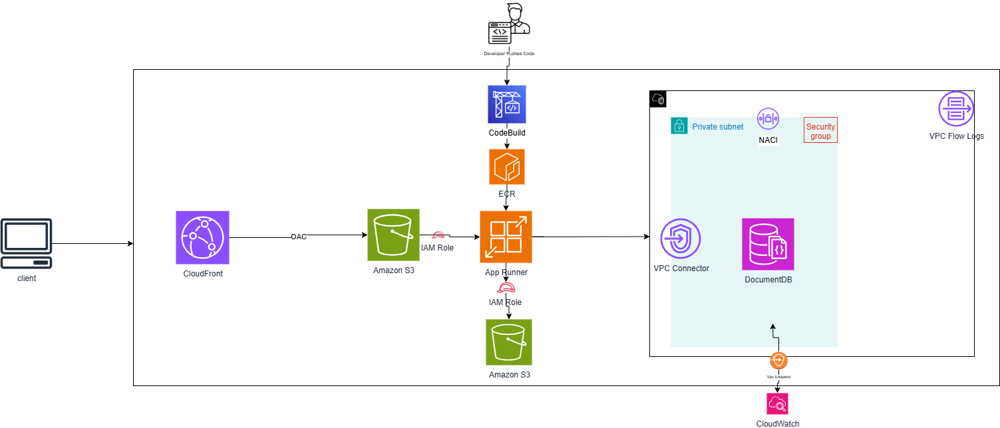
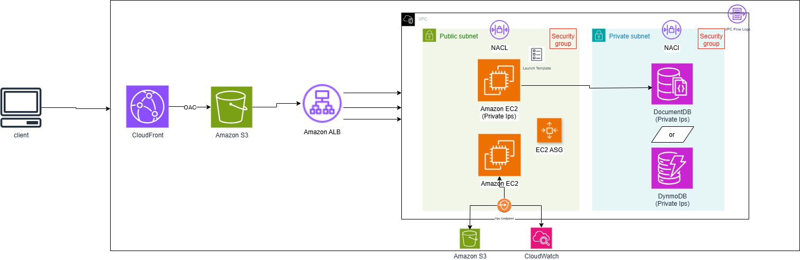

# Table of Content

[Project Brief Introduction ](#devflix-app-brief-introduction)

[Problem Description  ](#problem-description)

[Solution 1](#solution-1-app-runner--ecr--codebuild--documentdb--s3--cloudfront)

[Solution 2](#solution-2-alb--vpc--ec2--asg--documentdb--s3--cloudfront)

[Attachment](#attachments)

## Devflix App Brief Introduction

Devflix is a MERN stack web app (MongoDB, Express, React, Node.js) that lets users explore, search, and interact with movies and TV shows using the TMDB API. It features secure JWT-based authentication, password recovery, and email notifications for account management. Users can search for movies, TV shows, and actors, fetch similar titles, and view their search history. The responsive frontend includes signup, login, email verification, and the ability to watch trailers. With a sleek, intuitive design, the app delivers a seamless experience from signup to streaming.

## Problem Description 

Deploying a MERN stack application like Movie Explorer requires a setup that is scalable, cost-effective, and performant. The backend must handle variable user traffic efficiently, while the database reliably stores user data, search history, and media metadata. Frontend assets and user-uploaded media need to be delivered quickly and globally. The deployment should also be simple to maintain and update, minimizing operational overhead, while optimizing infrastructure costs for a non-critical application.This is a non-critical application, deployed in a single Availability Zone (AZ), so multi-AZ high availability is not required.

## Solution 1: App Runner + ECR + CodeBuild + DocumentDB + S3 + CloudFront

The backend Node.js/Express app runs in App Runner with Docker, and CodeBuild automatically updates the app whenever code changes are pushed to ECR. DocumentDB provides scalable backend storage, while S3 stores user-uploaded assets. The React frontend is deployed as a static website on S3 and delivered globally via CloudFront for fast access. This setup ensures automatic updates, scalable backend handling, and efficient static content delivery.

## Solution 2: ALB + VPC + EC2 + ASG + DocumentDB + S3 + CloudFront

The backend Node.js/Express app runs on EC2 instances in a public subnet, managed by an Auto Scaling Group (ASG) and distributed via an Application Load Balancer (ALB). DocumentDB in a private subnet provides secure, scalable backend storage, while EC2 instances communicate with S3 for asset storage and CloudWatch monitoring. The React frontend is deployed as a static website on S3 and delivered globally via CloudFront. This setup ensures scalable backend handling, secure data storage, and efficient frontend and asset delivery.

## Attachments:

Attachments include:

- Project recording.

- Live URL for the project.

- API URL – it has multiple routes, but the root route (/) simply returns "Hello World".

[Devflix URL](https://d3kgyzvfykmd3v.cloudfront.net/)

[API URL (APP Runner)](https://rr6jhimnje.eu-central-1.awsapprunner.com/)
